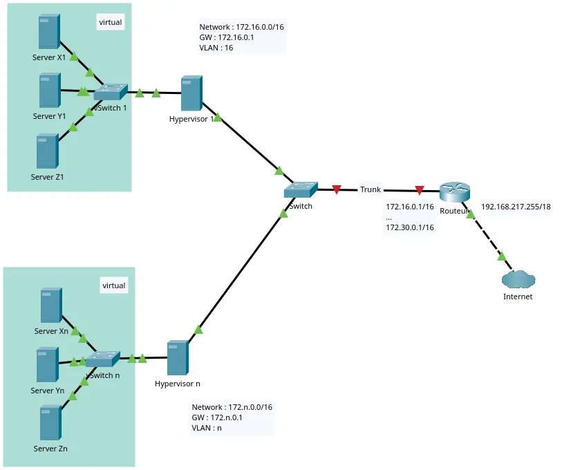

# Organisation

## Évaluation 

L'évaluation est continue, elle consiste à la présentation des différentes étapes à réaliser (cfr. plan).

Pour la _seconde session_, toutes les étapes doivent être présentées. 

## Planning

_Planning informatif pouvant être sujet à changements._

| **Séance** | **Sujets** |  **Objectifs**                     |
|------------|------------|------------------------------------|
| **1**       | Introduction à la virtualisation.  Prise en main du matériel.  | Concepts clés de la virtualisation et des hyperviseurs. Démonstration avec QEmu, virt-manager. Prise en main du matériel. Répartition en groupes.|
| **2**       | Réseaux dans les hyperviseurs |Configuration des réseaux virtuels (vSwitch, _bridge_, NAT, VLANs…). Installation de l'hyperviseur. |
| **3**       | Installation et configuration de l'hyperviseur (Proxmox) | Installer un hyperviseur sur un serveur physique et configurer un cluster basique; Proxmox.|
| **4**       | Gestion des VMs sur un hyperviseur           | Créer, configurer et gérer des VMs (CPU, RAM, disques, réseau). |
| **5**       | Stockage (**SAN** _storage area network_)  dans les hyperviseurs | Configuration du stockage partagé (NFS/iSCSI).|
| **6**       | Gestion avancée de l'hyperviseur      | Configurer les snapshots, la migration de VMs, le stockage partagé et le monitoring (de l'hyperviseur) |
| **7**       | Automatisation avec Ansible            | Automatiser la configuration de serveurs et de conteneurs avec Ansible. |
| **8**       | Automatisation avec Ansible (suite)       | Automatiser la configuration de serveurs et de conteneurs avec Ansible. |
| **9**       | Conteneurisation avec Docker Docker Compose et réseau Docker          | Installer Docker, créer des conteneurs, et travailler avec des images Docker. Automatiser les déploiements avec Docker Compose et configurer les réseaux Docker. |
| **10**      | Finalisation | Finalisation du _lab_|
| **11**      | **Séance spéciale** : présentation de Kubernetes par une ou un intervenant externe ||
|**12**       | Présentation finale du travail ||

## Organisation des séances

Le travail au cours se fait par équipe de 4 personnes. Il y a 2, 3 ou 4 équipes par groupe classe. 

Une séance de cours se compose de : une présentation théorique de 15-30 min, de travail en équipe et d'une clôture qui consiste à présenter aux autres le travail effectué. 

Un rapport complet est rédigé au fil des séances, au format **markdown**  et dans un dépôt **git**. 

### *Check list* 

_(Cette liste sera construite au fur et à mesure du cours)_

|Sujet          | Détail                    ||
|--             |--                         |--|
|Matériel       |Reconnaissance du matériel et état des lieux.| 🔲 |
|Installation   |Installation de l'hyperviseur.| 🔲 |
|Accessibilité  |L'hyperviseur est accessible en ssh et à distance au sein du local. | 🔲 |
|Configuration réseau  |À chaque groupe est associé un _range IP_ et un VLAN.  La configuration réseau _hyperviseur-switch-router-extérieur_ est opérationnelle.| 🔲 |
|Rack           |L'hyperviseur est dans le rack (selon les possibilités). | 🔲 |
|Services       |Au minimum deux services internet tournent sur 2 machines virtuelles différentes [^f1]. | 🔲 |
|Conteneur      |Déploiement d'au moins 2 conteneurs (avec un service)| 🔲 |
|SAN            |Installation d'un SAN par groupe-classe (chaque personne de chaque équipe est capable d'agir sur le SAN) Au moins un des services a son _storage_ sur le SAN.   | 🔲 |
|Cluster        | Mettre au moins deux hyperviseurs en _cluster_ (un sous-groupe avec un autre sous-groupe) | 🔲 |
|Migration      |Une migration d'une machine est possible d'un hyperviseur à un autre.| 🔲 |
|Ansible        |Automatisation d'une install d'une machine virtuelle avec un environnement à définir.| 🔲 |
|   || 🔲 |
|   || 🔲 |

[^f1]: [Liste de services web installables](https://docs.google.com/document/d/1u57PAqw5KZpO-jKE0YdORzq0XbSkMCoyncOtNzU62X4/edit?usp=sharing) Chaque groupe peut proposer d'autres services. **La liste est informative**. 

## Aspects pratiques et réseaux

### Configuration réseau 

- Range d'IP : `172.X.0.0/16` où `16 ≤ X ≤ 31` en fonction du groupe.  
- _Default gateway_ : `172.X.0.1` et le routeur fait le routage nécessaire.  
- Chaque groupe fait partie d'un VLAN

Pour le routeur, une interface est configurée pour recevoir tous les VLANs et une autre pour accéder au _default gateway_ — `192.168.192.1`. Cette interface aura comme IP `192.168.217.255`. 

### Configuration réseau alternative

_En cas de difficulté de configuration du réseau, cette configuration réseau peut-être envisagée_ — c'est moins bien. 

Toutes les machines sont connectées dans le même _switch_ non configuré et sont toutes dans le même _range_ IP. Il n'y a aucune configuration à faire **excepté** une configuration statique des IP.

Nous utilisons le _range_ d'IP du réseau expérimental : 

- Range d'IP : `192.168.192.0/18`
- _Default gateway_ : `192.168.192.1`
- Par convention, chaque groupe se voit attribuer un _range_ dans `192.168.217.X` où `1 ≤ X ≤ 254`.