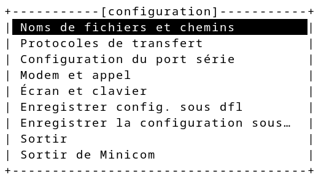
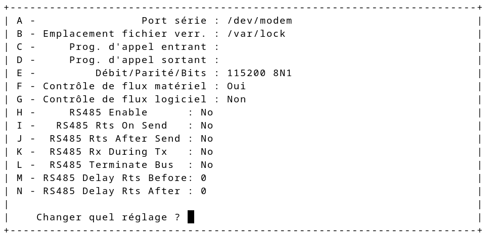

# Outils divers

## Utiliser une distribution live

Une distribution _live_ (anciennement _live CD_) est une distribution linux bootable sur un support externe et qui ne modifie pas le _file system_ (système de fichiers) de l'hôte. 

Pour l'utiliser, il suffit de _booter_ sur l'USB. 

Pour préparer une telle clé USB (à partir d'un système linux) :

- télécharger l'ISO 

    Par exemple un fichier `debian-live-<version>-<system>-<saveur>`

- insérer sa clé USB et l'identifier. On peut utiliser `fdisk -l` ou `lsblk` par exemple avant et après insertion. 

    ```bash 
    ~# fdisk -l 
    [cut]
    Périphérique Amorçage     Début       Fin  Secteurs Taille Id Type
    /dev/sda1    *             2048 479801343 479799296 228,8G 83 Linux
    /dev/sda2             479803390 500117503  20314114   9,7G  5 Étendue
    /dev/sda5             479803392 500117503  20314112   9,7G 82 partition…

    [cut]
    Périphérique Amorçage Début      Fin Secteurs Taille Id Type
    /dev/sdb1    *           64 15257599 15257536   7,3G  b W95 FAT32
    ```

    Ici, `/dev/sda` est le disque principal et `/dev/sdb` est la clé que l'on vient d'insérer. Elle est déjà partitionnée en une seule partition FAT32… que l'on va écraser. 

-  copier l'ISO (l'opération prend du temps)

    > Un ISO se copie en blocs. Le fichier ISO contient tout le système de fichiers.

    ```bash 
    ~# dd if=debian-live.iso of=/dev/sdb bs=4M status=progress; sync
    ```

- _booter_ sur la clé


### *Troubleshooting* et commandes

Lors de l'utilisation d'une _live distribution_, le login est `user` et le mot de passe associé est `live`. 

L'utilisateur `user` a un `sudo` illimité et sans mot de passe ce qui a pour effet que `sudo -i` sans mot de passe donne un accès `root`. 

```bash
~# cat /etc/sudoers.d/live
user ALL=(ALL) NOPASSWD: ALL
```

:::tip LIENS    

[Debian live](https://www.debian.org/CD/live/)  
[Rendre sa clé bootable persistante](https://debian-facile.org/doc:install:deblive-usb-persistant)

:::

## Connection COM

Pour se connecter à la console d'un _switch_ ou d'un _router_, on utilise le port COM. 

Sous MS Windows, le programme `putty` fait bien l'affaire.   
Sous linux, il existe plusieurs programmes (dont `putty` _by the way_). Par exemple : `minicom`. 

Sa configuration se fait _via_ `minicom -s`.

 



Une fois la configuration faite, lancer `minicom` (sans paramètre cette fois).

:::tip 
Il est également possible d'utiliser `minicom` sans le configurer en passant l'interface en argument avec l'option `-D`. 
:::


