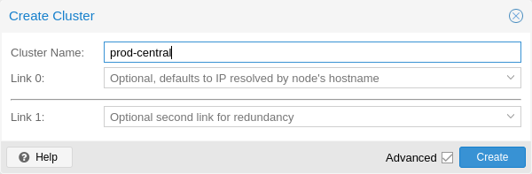

# Virtualisation (suite)

## Cluster

_Quand l'hyperviseur n'est plus seul…_

Proxmox VE propose la gestion de _clusters_ regroupant plusieurs hyperviseurs. Lorsque plusieurs hyperviseurs sont configurés de cette manière, 
- chaque hyperviseur voit les machines et les conteneurs se trouvant sur les autres hyperviseurs ;
- des migrations peuvent être faites ;
- une redondance peut être mise en place.

Pour créer un cluster, il faut disposer d'au moins deux machines Proxmox VE qui _se voient_ sur le réseau. Pour de la « haute disponibilité » et une réaction en cas de panne, il en faudra au moins trois (cfr. infra). 

Plus précisément, il faut 
- pouvoir se connecter en UDP (ports 5405-5412)
- être à la même heure (par ex. _via_ `ntp`)
- pour la haute disponibilité, les nœuds doivent être de la même version de proxmox
- _proxmox recommande une carte réseau dédiée pour la gestion du cluster_
- _la migration à chaud entre machines de processeurs provenant de vendeurs différents « peut fonctionner »_

:::warning 
Pour pouvoir faire de la réplication à chaud et mettre en place de la haute disponibilité, le système de fichier (_file system_) doit être **distribué** (cfr [stockage](stockage.md)) ou doit être `ZFS` s'il est local. 
:::

Dans les paramètres du **datacenter**, la section _cluster_ propose la création du _cluster_ : 
- lui choisir un nom;
- l'interface réseau par laquelle les serveurs se voient. 

  
_Source Proxmox docs_

En console, la création peut se faire par : 

```bash 
~:# pvecm create <CLUSTERNAME>
```

Pour vérifier le statut d'un cluster : 

```bash
~:# pvecm status 
```

Une fois le _cluster_ créé, utiliser les « _join information_ » pour lier les différents serveurs.

D'un côté 


… et de l'autre…


En console, l'ajout d'un nœud peut se faire par : 

```bash
~:# pvecm add <IP ADDRESS CLUSTER> 
```

:::info
Chaque hyperviseur peut gérer **toutes les machines virtuelles** du cluster et la section _summary_ affiche les ressources globales du cluster. 
:::

En console, la liste des nœuds est donnée par `pvecm nodes`. 


Si un cluster a été créé par erreur ou si vous souhaitez le supprimer pour repartir de zéro, voici les étapes à suivre. Notez que cette opération est destructive et doit être effectuée avec précaution.

1. **Vérifiez l'état du cluster**  
    Avant de commencer, assurez-vous de vérifier l'état actuel du cluster pour identifier les nœuds qui y participent. (Et profitez-en pour noter le nom des nœuds).  
    ```bash
    pvecm status
    ```

2. **Supprimez les nœuds du cluster**  
    Pour chaque nœud du cluster, exécutez la commande suivante pour le retirer proprement :  
    ```bash
    pvecm delnode NODE_NAME
    ```
    Remplacez `NODE_NAME` par le nom du nœud à supprimer. Répétez cette étape pour tous les nœuds sauf le dernier.


3. **Supprimez le cluster sur le dernier nœud**  
    Une fois que tous les autres nœuds ont été supprimés, exécutez les commandes suivantes sur le dernier nœud pour supprimer le cluster :  
    ```bash
    systemctl stop pve-cluster
    systemctl stop corosync
    rm -rf /etc/pve/corosync.conf
    rm -rf /etc/corosync/*
    systemctl start pve-cluster
    systemctl start corosync
    ```

:::danger 
La suppression d'un cluster est irréversible. Assurez-vous d'avoir sauvegardé toutes les données importantes avant de procéder.
:::

:::danger 
Lorsque la doc me dit d'exécuter `rm -rf <dir>`, je suis méfiant. 

- Je relis
- Je prends une copie des fichiers à supprimer
- Je supprime
- Si c'est cassé, je remets les fichiers et je relance les services. 
:::

[Suppression d'un nœud _via_ la commande `pcecm`](https://pve.proxmox.com/pve-docs/chapter-pvecm.html#_remove_a_cluster_node)

### Quorum

Proxmox utilise la notion de _quorum_ pour garder les clusters dans un état cohérent. 

> A quorum is the minimum number of votes that a distributed transaction has to obtain in order to be allowed to perform an operation in a distributed system.  
> Quorum (distributed computing)  
>— from Wikipedia 

### Migration et réplication 

La **migration** et la **réplication** dans Proxmox sont deux processus distincts, utilisés pour gérer les machines virtuelles (VM) et les conteneurs, mais avec des objectifs différents.

Une **migration** est le déplacement d'une machine virtuelle ou d'un conteneur d'une machine à une autre au sein du même cluster. 

La **réplication** est la copie régulière des données d'une machine virtuelle ou d'un conteneur vers un autre nœud pour garantir leur disponibilité en cas de panne.

| **Aspect**         | **Migration**      | **Réplication**               |
|--------------------|-------------------|--------------------------------|
| **Finalité**       | Déplacement d'une VM/conteneur    | Sauvegarde redondante         |
| **Moment**         | Instantané (ponctuel)            | Planifié (récurrent)          |
| **Utilisation**    | Maintenance/Équilibrage de charge | Haute disponibilité (HA)      |
| **Impact utilisateur** | Presque invisible (live migration) | Impact nul sauf en récupération |


Pendant une migration en direct, la mémoire et l'état de la VM sont transférés sans interruption notable pour l'utilisateur.

```bash
qm migrate ID_VM NOEUD_DESTINATION
pct migrate ID_CONTENEUR NOEUD_DESTINATION
```


## Haute disponibilité

Actuellement, les utilisateurices sont habitués à pouvoir accéder à l'information de n'importe où et n'importe quand. Il est donc important qu'un service soit accessible la _plupart du temps_. 

Si l'on parle d'une disponibilité de 99%, cela signifie que la période d’inaccessibilité (_downtime_) est de `365 jours * 0.01` soit **3.65 jours**.  

| Disponibilité  | _Downtime_ annuel
|--               |-- 
|99% |3.65 days
|99.9%|8.76 hours
|99.99%|52.56 minutes
|99.999%|5.26 minutes
|99.9999%|31.5 seconds
|99.99999%|3.15 seconds

Pour augmenter la disponibilité :

- utiliser du matériel de qualité
- éliminer les _single point of failure_ 
    - utiliser un UPS (_uninterruptible power supply_)
    - utiliser plusieurs alimentations sur les serveurs
    - ajouter de la redondance dans le réseaux (cartes…)
    - utiliser des disque en RAID pour le stockage local
    - stocker les données des VM sur du stockage distribué et redondant 
- réduire les temps d'indisponibilité 
    - une équipe disponible
    - avoir d'autres nœuds et du matériel de remplacement à disposition
    - avoir une détection d'erreur automatique 
    - avoir un basculement (_failover_) automatique l'un serveur à l'autre 

Proxmox fournit `ha-manager`, un composant software facilitant la détection d'erreurs et le basculement. 

Ressource (_resource_) : une ressource ou un service est identifiée par son _id_. Par exemple : **vm:100** est une machine virtuelle d'_id_ 100. Les types de resources sont, les machines virtuelles (_vm_) et les conteneurs (_ct_).

La haute disponibilité est configurable via le GUI et en ligne de commande. 


## Récapitulatif de commandes Proxmox

_Généré par une IA sur base de la documentation Proxmox_

**Gestion du cluster**

```bash
# Créer un nouveau cluster
pvecm create CLUSTER_NAME
# Crée un nouveau cluster Proxmox avec le nom spécifié

# Générer un jeton pour joindre un cluster
pvecm gentoken
# Génère les informations nécessaires pour qu'un nouveau nœud rejoigne le cluster

# Ajouter un nœud à un cluster existant
pvecm add IP_DU_PREMIER_NOEUD 
    --fingerprint XX:XX:XX:XX:XX:XX:XX:XX:XX:XX:XX:XX:XX:XX:XX:XX
# Ajoute le nœud courant au cluster en utilisant l'IP du nœud 
# existant et l'empreinte de sécurité

# Vérifier l'état du cluster
pvecm status
# Affiche l'état actuel du cluster, y compris les nœuds et leur statut

# Vérifier le quorum
pvecm quorum
# Affiche les informations relatives au quorum du cluster

# Modifier l'attente de quorum
pvecm expected 1
# Force le cluster à fonctionner avec un seul nœud (à utiliser avec précaution)

# Quitter le cluster
pvecm leave
# Retire le nœud courant du cluster

# Supprimer un nœud inaccessible du cluster
pvecm delnode NODE_NAME
# Retire un nœud spécifique du cluster, utile si le nœud n'est plus accessible

# Diagnostiquer les problèmes de cluster
pvecm diag
# Affiche des informations détaillées pour le diagnostic du cluster

# Mettre à jour les certificats du cluster
pvecm updatecerts --force
# Force la mise à jour des certificats du cluster, 
# utile en cas de problèmes de sécurité
```
**Gestion des machines virtuelles**

```bash
# Migrer une VM en ligne
qm migrate VMID TARGET_NODE --online
# Déplace une VM vers un autre nœud sans interruption de service

# Migrer une VM hors ligne
qm migrate VMID TARGET_NODE
# Déplace une VM vers un autre nœud avec arrêt préalable

# Définir le type de migration
qm set VMID --migration_type secure
# Configure le type de migration (secure, insecure ou websocket)

# Configurer la bande passante de migration
qm set VMID --migration_speed SPEED_MIB_PER_SECOND
# Limite la bande passante utilisée pendant la migration (en MiB/s)

# Définir l'interface réseau pour la migration
qm set VMID --migration_network NETWORK_INTERFACE
# Spécifie l'interface réseau à utiliser pour la migration

# Configurer le délai de migration
qm set VMID --migration_timeout SECONDS
# Définit la durée maximale d'une migration avant qu'elle soit annulée
```

**Haute disponibilité (HA)**

```bash
# Créer un groupe HA
ha-group create GROUPE_NAME -nodes node1,node2,node3
# Crée un nouveau groupe de haute disponibilité avec les nœuds spécifiés

# Ajouter une VM à la HA
ha-manager add vm:VMID --group GROUPE_NAME
# Configure une VM pour être gérée par le système de haute disponibilité

# Ajouter un conteneur à la HA
ha-manager add ct:CTID --group GROUPE_NAME
# Configure un conteneur pour être géré par le système de haute disponibilité

# Définir des nœuds préférés
ha-manager set vm:VMID --node NODE_NAME
# Spécifie un nœud préféré pour l'exécution d'une ressource HA

# Configurer des restrictions
ha-manager set vm:VMID --restrictions "node ne node3"
# Définit des règles pour éviter certains nœuds

# Afficher l'état de la HA
ha-manager status
# Affiche l'état actuel de toutes les ressources HA

# Afficher les journaux HA détaillés
ha-manager status --verbose
# Affiche des informations détaillées sur l'état de la HA, 
# y compris les journaux

# Démarrer une ressource HA
ha-manager start vm:VMID
# Démarre manuellement une ressource gérée par la HA

# Arrêter une ressource HA
ha-manager stop vm:VMID
# Arrête manuellement une ressource gérée par la HA

# Migrer une ressource HA
ha-manager migrate vm:VMID NODE_NAME
# Déplace manuellement une ressource HA vers un nœud spécifique

# Désactiver la surveillance HA
ha-manager disable vm:VMID
# Désactive temporairement la surveillance HA pour une ressource

# Réactiver la surveillance HA
ha-manager enable vm:VMID
# Réactive la surveillance HA pour une ressource précédemment désactivée

# Simuler une défaillance de nœud
ha-manager failover NODE_NAME
# Simule une défaillance d'un nœud pour tester la HA 
# (à utiliser uniquement en test)
```

**Stockage**

```bash
# Lister les stockages disponibles
pvesm status
# Affiche tous les stockages configurés et leur état

# Créer un stockage partagé NFS
pvesm add nfs STORAGE_ID 
    --path /mnt/pve/STORAGE_ID  
    --server NFS_SERVER 
    --export /export/path
# Configure un nouveau stockage NFS partagé

# Créer un stockage Ceph
pvesm add rbd STORAGE_ID 
    --monhost "IP_MON1,IP_MON2,IP_MON3" 
    --pool POOL_NAME
# Configure un nouveau stockage Ceph RBD

# Activer un stockage
pvesm set STORAGE_ID --enable 1
# Active un stockage précédemment désactivé

# Désactiver un stockage
pvesm set STORAGE_ID --enable 0
# Désactive temporairement un stockage

# Configurer un stockage pour la HA
pvesm set STORAGE_ID --shared 1
# Marque un stockage comme partagé, 
# requis pour la migration à chaud et la HA
```

**Sauvegarde et restauration**

```bash
# Créer une sauvegarde d'une VM
vzdump VMID --storage STORAGE_ID --mode snapshot
# Crée une sauvegarde complète d'une VM en utilisant des snapshots

# Créer une sauvegarde de plusieurs VMs
vzdump VMID1,VMID2 --storage STORAGE_ID
# Sauvegarde plusieurs VMs

# Planifier une sauvegarde
echo "0 2 * * * vzdump VMID 
    --storage STORAGE_ID 
    --mode snapshot" > /etc/cron.d/backup-vm
# Configure une sauvegarde quotidienne à 2h du matin

# Restaurer une VM à partir d'une sauvegarde
qmrestore /var/lib/vz/dump/vzdump-qemu-VMID-DATE.vma.lzo NEW_VMID
# Restaure une VM à partir d'une sauvegarde avec un nouveau VMID
```

**Commandes réseau**

```bash
# Configurer un bridge réseau
pve-bridge create vmbr1 -address 192.168.1.1/24
# Crée un nouveau bridge réseau avec l'adresse IP spécifiée

# Vérifier la configuration réseau
cat /etc/network/interfaces
# Affiche la configuration réseau actuelle

# Appliquer les changements réseau
ifreload -a
# Recharge la configuration réseau sans redémarrer
```

**Commandes de sécurité**

```bash
# Générer une nouvelle paire de clés SSH
ssh-keygen -t rsa -b 4096
# Crée une nouvelle paire de clés RSA pour l'authentification SSH

# Distribuer une clé SSH entre nœuds
ssh-copy-id root@NODE_IP
# Copie la clé publique vers un autre nœud pour permettre la connexion sans mot de passe

# Vérifier les journaux d'authentification
tail -f /var/log/auth.log
# Affiche les tentatives d'authentification récentes

# Modifier les règles de pare-feu
pve-firewall compile
# Compile et applique les règles de pare-feu actuelles
```


https://pve.proxmox.com/pve-docs/chapter-ha-manager.html


## Stockage distant

_iCSI_

_work in progress_
